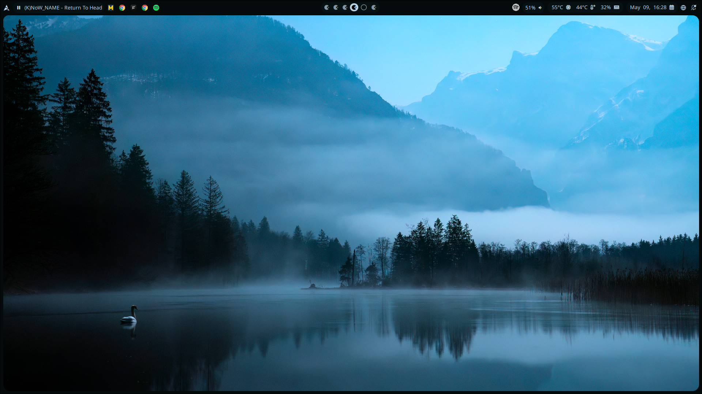
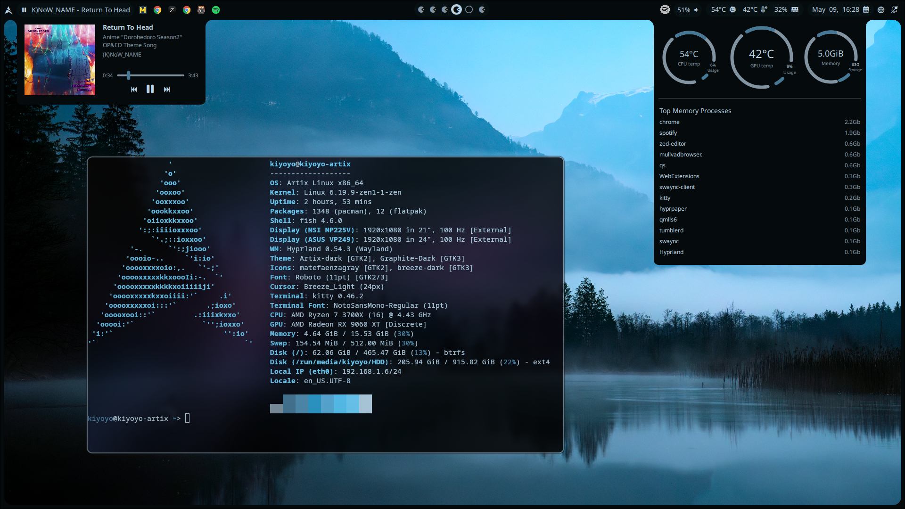
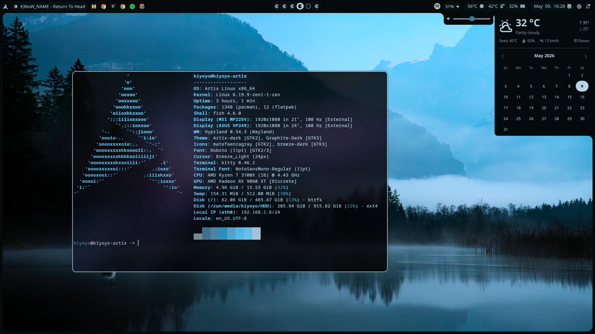
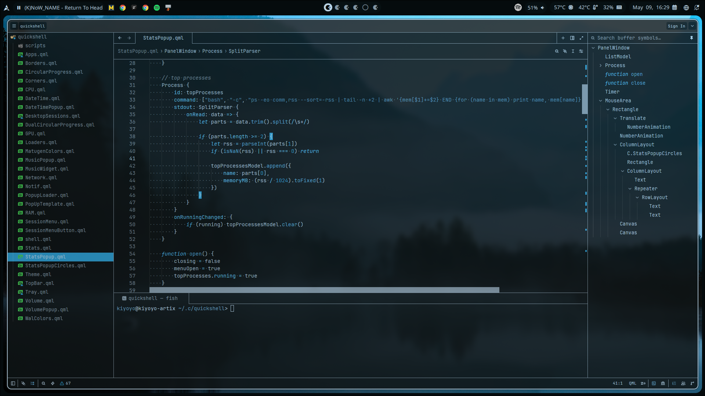

# kiyoyo-quickshell

my personal Hyprland rice built around Quickshell and pywal.

## Screenshots

## Stack

| | |
|---|---|
| OS | Artix Linux x86_64 |
| WM | Hyprland 0.54.3 (Wayland) |
| Shell | Quickshell |
| Terminal | Kitty + Fish |
| Editor | Zed / VSCodium |
| Icons | Papirus / breeze-dark |
| Theming | pywal |
| Weather | wttr.in |

## Hardware

- **CPU** AMD Ryzen 7 3700X (16 threads) @ 4.43 GHz
- **GPU** AMD Radeon RX 9060 XT
- **RAM** 15.53 GiB
- **Displays** 2 monitors both 1920×1080 @ 100 Hz

## Features

### Music
- Bar icon click to play/pause
- Scroll on music widget to skip next/prev
- Popup with album cover, track details, progress bar, and prev/next/pause controls

### Volume
- Slider on the bar

### Stats
- CPU, GPU, RAM usage shown on bar
- Popup with detailed CPU/GPU/storage info
- Top processes sorted by RAM usage (aggregated, btop-style)

### Date & Weather
- Popup with live weather from wttr.in
- Interactive calendar with month navigation